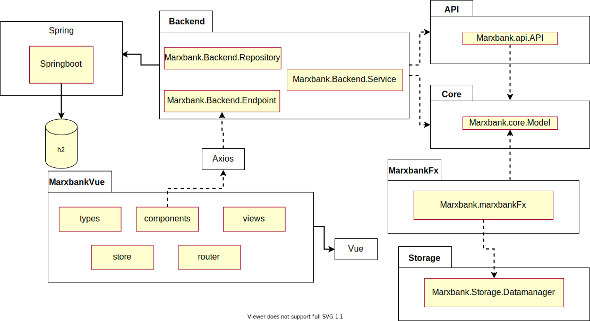

# Marxbank

[](https://gitpod.stud.ntnu.no/#https://gitlab.stud.idi.ntnu.no/it1901/groups-2021/gr2127/gr2127)


[](https://gitlab.stud.idi.ntnu.no/it1901/groups-2021/gr2127/it1901-prosjekt/-/commits/master) 


[](https://gitlab.stud.idi.ntnu.no/it1901/groups-2021/gr2127/gr2127/master) 

> Class struggle is inevitable in Object-Oriented Programming
>
> -- <cite>Karl Marx</cite>

## Pakkediagram av løsning



## Innhold

### Kodingsprosjektet

Kodingsprosjektet består av seks moduler: core, backend, api, storage, marxbankfx og marxbankvue. Les mer i [marxbank](https://gitlab.stud.idi.ntnu.no/it1901/groups-2021/gr2127/gr2127/-/tree/master/marxbank)

## Hvordan kjøre appen

Gå først inn i marxbank mappe.

Du kan installere og kjøre tester på alle modulene gjennom å kjøre:

```bash
mvn install
```

Så start Rest-serveren med

```bash
mvn spring-boot:run -pl backend
``` 

så kan du enten starte webapplikasjonen med

```bash
mvn frontend:install-node-and-npm frontend:npm@install frontend:npm@serve -pl marxbankvue
```

eller starte javafx med

```bash
mvn javafx:run -pl marxbankfx
```

Alternativt kan du starte både Rest-serveren og web-klienten samtidig ved å kjøre `./serve-app.sh` i rotmappa

## Jacoco code coverage

### Installasjon

Åpne en terminal kjør ` mvn install ` og ` mvn clean jacoco:prepare-agent install jacoco:report ` for å generere en testdekningsrapport.

### For å se rapporten

Finn ` index.html ` under target/site (alle modulene har en egen target-mappe. Velg den modulen du vil ha rapport fra). Kopier stien til filen og lim den inn i nettleser.

## JSON datastruktur

For å se hvordan vi lagrer dataen vår lokalt med json, se [Readme i storage](storage/Readme.md#lagring-i-Json)

## Kall til Databasen

For å se alle forskjellige kall, strukturen på forespørselen, og hva backend kan sende tilbake. Se [full api dokumentasjon](/backend/docs/fullAPI.md)
