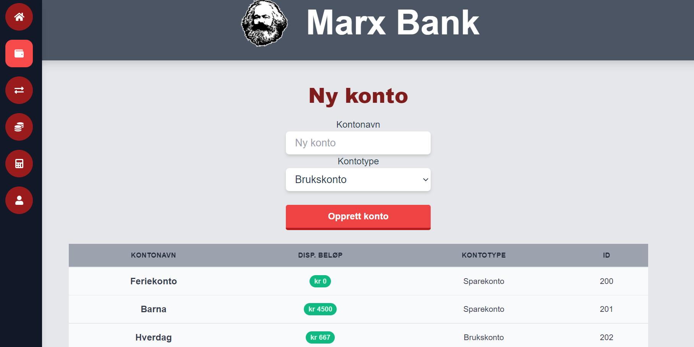
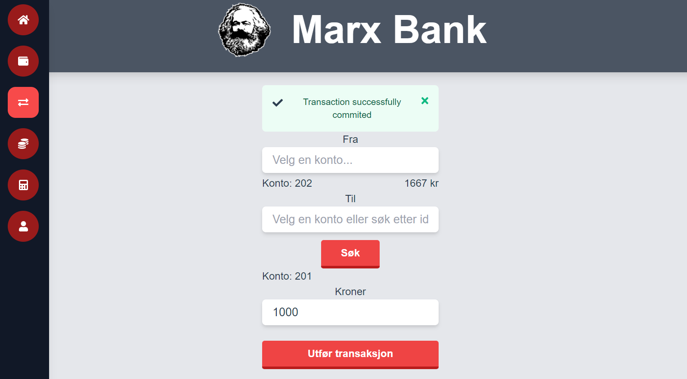
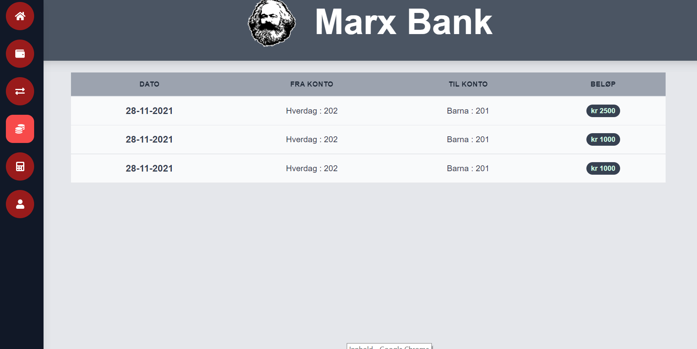

# Brukerhistorier

Her er alle brukerhistoriene som er blitt benyttet for å beskrive denne applikasjonens funksjonalitet. Samtlige brukerhistorier skal være på formen:


```
Som en ___ ønsker jeg ___ slik at ___.
```

Alle brukerhistoriene vil ha en prioritetsgrad (høy, middels lav) etter hvor viktig de er for applikasjonens funksjonalitet. I tillegg vil de også beskrive hva som er viktig å kunne gjøre og se visuelt. 

## Konto (#1) – høy prioritet
Som en bankkunde ønsker jeg muligheten til å opprette ulike kontoer i banken slik at jeg har en konto jeg for eksempel kan betale med og motta penger.

### Viktig å kunne gjøre
* Opprette ulike typer konto
* Navngi konto

### Viktig å kunne se
* Disponibelt beløp på konto
* Navn på konto

### Illustrerende skjermbilde



## Overføre (#2) – høy prioritet
Som en bankkunde ønsker jeg muligheten til overføre penger slik at jeg kan betale fra en av mine kontoer til en annen konto. 

### Viktig å kunne gjøre
* Velge hvem jeg skal overføre til
* Velge beløp

### Viktig å kunne se
* Overfører og mottaker
* Beløp

### Illustrerende skjermbilde



## Betalingsoversikt (#3) – middels prioritet
Som en bankkunde ønsker jeg muligheten til ha oversikt over betalinger både til og fra konto slik at jeg har kontroll over alle transaksjoner som er gjort til og fra. 

### Viktig å kunne gjøre
* Bla gjennom tidligere transaksjoner


### Viktig å kunne se
* Tidligere transaksjoner
* Hvilken konto(er) som er involvert
* Dato for hver enkelt transaksjon
* Beløp

### Illustrerende skjermbilde



## Logg ut (#4) – lav prioritet
Som en bankkunde ønsker jeg muligheten til å logge ut slik at uvedkommende ikke kommer seg inn i nettbanken uten å logge seg inn. 

### Viktig å kunne gjøre
* Logge ut av banken med brukeren som er logget inn

### Viktig å kunne se
* Funksjonen/symbolet for å logge ut

### Illustrerende skjermbilde


## Sparekalkulator (#5) – middels prioritet

Som en bankkunde ønsker jeg å se hvor mye sparepengene mine kan vokse over en viss tid.

### Viktig å kunne gjøre
* Fylle inn startbeløp og fast månedlig beløp
* Sette spareperiode (i år)
* Sette rente (i prosent)

### Viktig å kunne se
* Totalbeløp etter perioden (uten skatt)

### Illustrerende skjermbilde


## Datalagring i Rest applikasjon (#6) - høy prioritet

Som en bankkunde ønsker jeg at jeg kan få tilgang til bankinformasjonen min overalt.

### Viktig å kunne gjøre
* Logge inn på samme bruker fra forskjellige maskiner koblet til samme server.
* Se bankinformasjonen sin fra forskjellige maskiner koblet til samme server.

## Nettklient (#7) - høy prioritet

Som en bankkunde ønsker jeg at jeg kan se bankinformasjonen min lett gjennom en nettleser.

### viktig å kunne gjøre
* Se bankinformasjonen på en god og intuativ måte
* Enkel løsning som er lett å bruke
* Har samme, om ikke mer, funksjonalitet enn FX applikasjonen

## Installerbar applikasjon (#8) - middels prioritet

Som en bankkunde ønsker jeg at jeg kan installere en applikasjon og se bankinformasjonen min.

### Viktig å kunne gjøre
* Installere marxbankFX
* lokal lagring av brukerdata

## innskudd og uttak av penger (#9) - lav prioritet

Som en bankkunde ønsker jeg at jeg kan ta ut og sette inn penger på kontene mine.

### Viktig å kunne gjøre:
* Sette inn penger på konto
* Ta ut penger