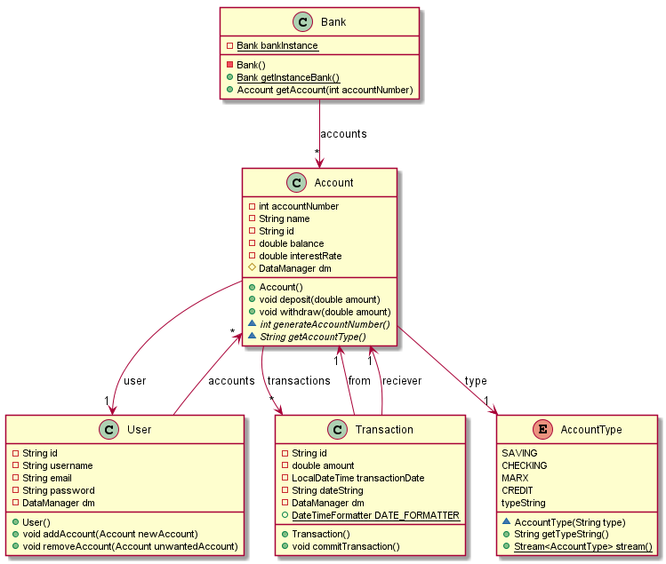
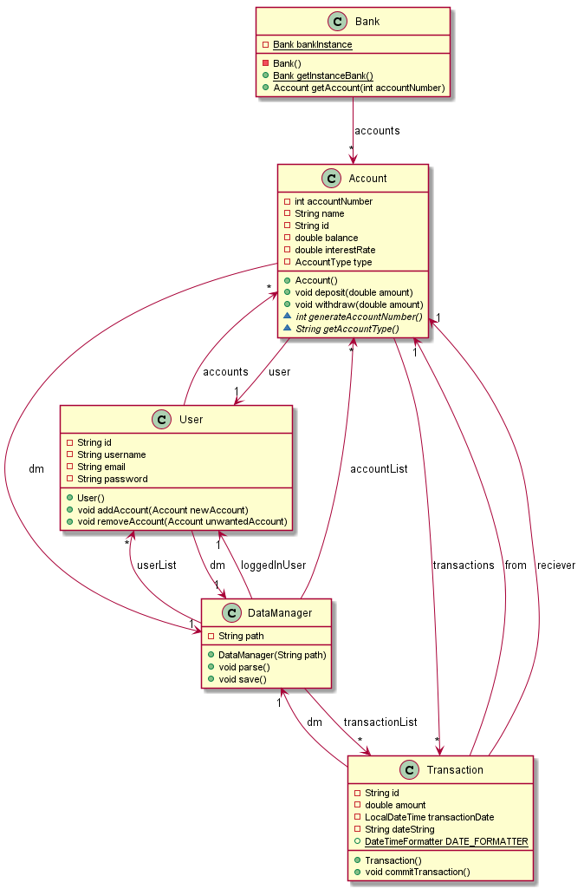

# Core
Core er modulen i applikasjonen vår, Marx bank, for delt kode og logikk som både frontend og backenden skal bruke.

## Installasjon
For å installere core kjører du `mvn install`

## Testing av Core
Testene er skrevet i Junit5 som er et rammeverk for testing av Java
For å teste core kjører du `mvn test -pl core`

## Testdekningsgrad med JaCoCo
For testdekningsgraden til Core bruker vi JaCoCo.
For å finne ut testdekningsgraden kjører du mvn clean `jacoco:prepare-agent install jacoco:report` også finner du rapport filen som heter `index.html` under `core/target/site`.

# Klassediagrammer

## Diagram av den generelle klassestrukturen

## Diagram av den generelle klassestrukturen med DataManager

## Diagram av hvilke klasser som arver fra Account

