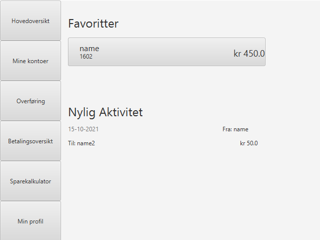
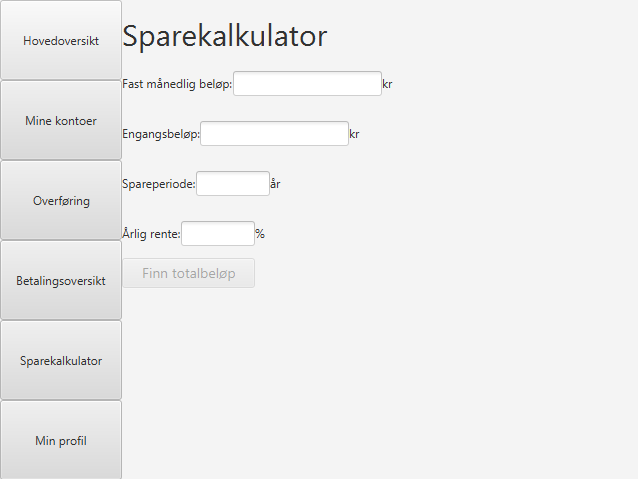
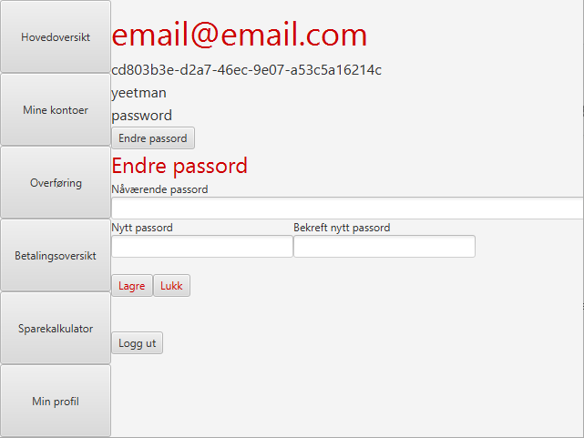
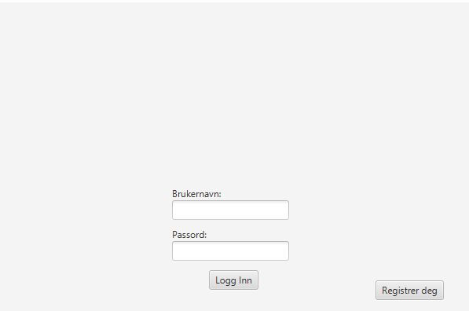
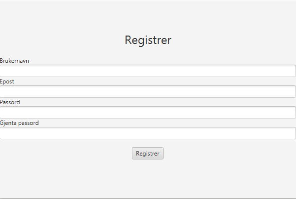

# Marxbankfx
Dette er frontend modulen til applikasjonen vår, Marx bank. Den er bygget på Javafx og Testfx

## Starting av frontend
For å starte frontend modulen kan du kjøre ```mvn javafx:run``` i marxbankfx mappen eller ```mvn javafx:run -pl marxbankfx``` fra hovedmappen

## Testing av frontend
Frontenden testes av Testfx, som er et eget rammeverk for å skrive tester til Javafx.
For å kjøre tester skriver du ```mvn test -pl marxbankfx```

Modulen genererer også en testdeksningsgrad ved hjelp av JaCoCo og kan kjøres slik `mvn clean jacoco:prepare-agent install jacoco:report`.

Rapporten vil ende opp som en egen fil som heter `index.html` som ligger i `marxbankfx/target/site`

## Forklaring av GUI

Brukergrensesnittet i Marx bank består av seks hovedfaner: "Hovedoversikt", "Mine kontoer", "Overføring", "Betalingsoversikt", "Sparekalkulator" og "Min profil". Navigasjon mellom de ulike fanene styres av `MainController`. I tillegg til dette, må man logge inn/registrere seg i en egen scene når man først åpner appen.

### Hovedoversikt

Hovedoversikten er der man starter etter å logge inn. Her kan man se sine favorittkontoer (foreløpig vises bare den første kontoen i kontolista), i tillegg til den nyeste aktiviteten. Ved å trykke på en av kontoene kommer man til en ny konto-fane, der mer detaljer om kontoen vises. Hovedoversikt-fanen styres av `HomeController`, og Konto-fanen styres av `AccountController`



### Mine kontoer

Mine kontoer viser en liste over alle kontoer registrert på den innloggede brukeren. Ved å trykke på en av kontoene kommer man til samme konto-fane som beskrevet under `Hovedoversikt`. I tillegg til dette finnes det en knapp som kan trykkes på for å registrere en ny konto. Man blir da tatt videre til en ny fane for dette. Her kan man velge kontotype og navn på den nye kontoen. Fanen for mine kontoer styres av `MyAccountsController`, og konto-registrerings-fanen styres av `CreateNewAccountController`.


### Overføring

I fanen for overføring kan man overføre penger fra en av sine egne kontoer til en annen registrert konto - både til sine egne og til andre brukere. Denne fanen styres av `TransactionController`.


### Betalingsoversikt

Betalingsoversikt viser en fullstendig liste over alle overførsler på den innloggede brukeren. Fanen styres av `MyTransactionsController`.


### Sparekalkulator

Sparekalkulatoren er en egen fane som ikke er knyttet til en bestemt bruker. Man kan bruke den til å regne ut hvor mye man sparer besert på fast månedlig beløp, engangsbeløp, spareperiode og årlig rente. Styres av `SavingsCalcController`.



### Profil

I profil-fanen kan man se informasjon om den innloggede brukeren, og endre passord. Endring av passord er styrt av en egen controller, `ChangePasswordController`, mens `ProfileController` styrer hovedfanen. I tillegg kan man logge ut ved å trykke på en knapp, som tar brukeren tilbake til innlogging.



### Logg inn

Man starter her når man først åpner appen. Kan logge inn med eksisterende brukernavn og passord, eller trykke på en knapp for å registrere ny bruker. Styres av `LogInController`.



### Registrering 

Registrering skjer i et eget skjermbilde der man kan velge brukernavn, epost og passord. Styres av `RegitserController`.



